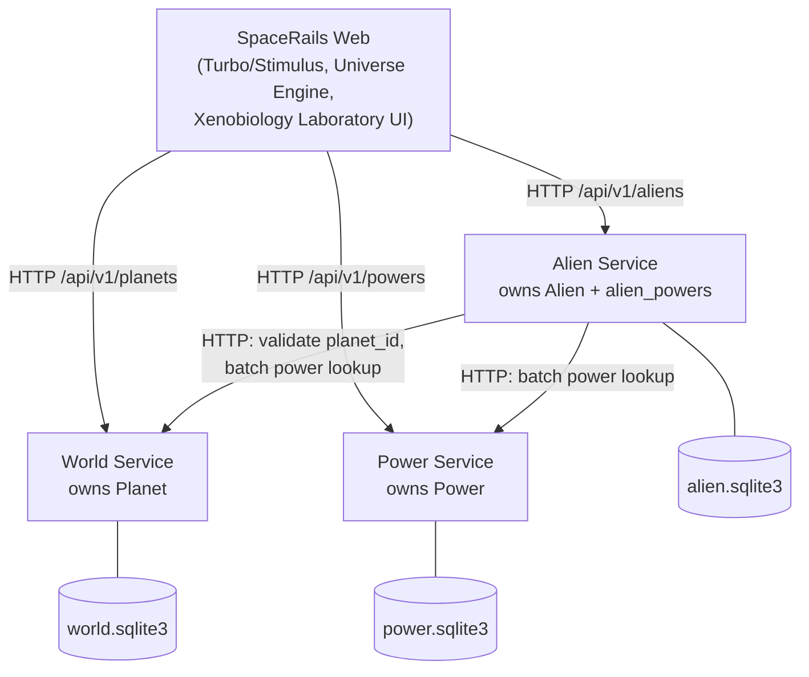

# SpaceRails — SOA Migration Plan

This is the live tracking document for the monolith → service-oriented
migration described in ADR-001 through ADR-005. It records what was actually
found during the audit, what phase the migration is in, and what is blocked
on a human decision.

## Standing principle: every service is audited by its own pipeline

Since root's RuboCop/Brakeman exclude `services/**/*` (Phase 2, to stop
false coupling between root and service tooling — see the Phase 2 record),
**every service must run its own tests, lint, security scan, and
dependency audit.** Root's checks being green does not mean the repository
is green. This applies today via each service's own `bin/rails test` /
`bin/rubocop` / `bin/brakeman` / `bin/bundler-audit`, run manually per
phase; wiring this into CI so it can't be silently skipped is documented
debt (see Phase 2/4 records), not yet implemented.

## Phase-0 audit (recorded, not assumed)

```text
Ruby            4.0.6 (.ruby-version)
Rails           8.1.3.1
Database        SQLite (adapter: sqlite3) — not Postgres, see ADR-003
Asset pipeline  Propshaft + Importmap (no Node build step)
Frontend        Turbo + Stimulus, server-rendered ERB, a persistent
                Three.js "Universe Engine" (app/javascript/controllers)
Domain models   Alien, Planet, Power, AlienPower (join model)
Routes          resources :powers / :planets / :aliens, root "aliens#index"
CI              .github/workflows/ci.yml (present — not modified this pass)
Docker/Kamal    Dockerfile + .kamal/ present (not modified this pass)
```

Baseline quality gates, recorded before any code changes in this pass:

```text
Rails tests      28 runs, 87 assertions, 0 failures, 0 errors
RuboCop          58 files inspected, no offenses
Brakeman         0 warnings
bundler-audit    no vulnerabilities found
```

Baseline data (must match after any future data migration, per ADR-003):

```text
Planets       1
Aliens        11
Powers        2
AlienPowers   10
```

## Dependency map (found by grep, not guessed)

```text
Alien  → Planet   belongs_to :planet                       (app/models/alien.rb)
Planet → Alien     has_many :aliens, dependent: :destroy     (app/models/planet.rb)
Alien  → Power     has_many :powers, through: :alien_powers  (app/models/alien.rb)
Power  → Alien     has_many :aliens, through: :alien_powers  (app/models/power.rb)
```

Call sites that cross the future World/Alien/Power boundary today:

```text
AliensController#index/#show   Alien.includes(:planet, :powers)
AliensController#create/#update  alien_params permits power_ids: []
aliens/_form.html.erb            Planet.all (select), Power.all (checkboxes)
aliens/_dossier.html.erb         alien.planet, alien.powers
aliens/_workstation.html.erb     alien.planet, alien.powers
aliens/_drawer.html.erb          a.planet
shared/_record.html.erb          record.planet, record.powers (shared by Planets/Powers show too)
```

Both boundary decisions below were **APPROVED by human review** after Phase 1
— see ADR-002 for the full writeup. Neither is implemented yet; they govern
Phase 9 (Alien Service extraction), not Phase 2.

1. `alien_powers` is owned by Alien Service (external `power_id`, no
   cross-service DB FK, batched lookups against Power Service).
2. `Planet.dependent: :destroy` keeps its current product semantic
   (deleting a Planet still removes its Aliens); only the implementation
   becomes a distributed operation, and only once Alien Service exists.
   Unchanged, untouched, in code exactly as today through Phase 8.

## Target architecture



Future domain flow — **documented as direction, not implemented**:

```text
World (environment/geology/biosphere)
  → influences →
Alien (biological adaptation)
  → influences →
Power (affinity/output)
```

## Phase checklist

```text
PHASE 0  Audit + baseline                                    DONE
PHASE 1  ADRs + migration plan + dependency map               DONE
         → alien_powers ownership + Planet cascade semantics: APPROVED
           by human review (see ADR-002). Neither is implemented yet.
PHASE 2  services/worlds skeleton (boots, /up health check)   DONE
         → STOP HERE for human review, per the migration's own
           incremental-checkpoint rule. No Planet data or API exists
           in the service yet — see services/worlds/README.md.
PHASE 3  World API contract (list/show Planet)                DONE
         → STOP HERE for human review. Planet data still lives only in
           root's database — nothing has been migrated or copied. See
           "Phase 3 record" below.
PHASE 4  World data ownership migration (copy, verify counts) DONE
         → STOP HERE for human review. Root remains runtime source of
           truth — see "Phase 4 record" below.
PHASE 5  Web → WorldsClient adapter (shadow reads only)        DONE
         → STOP HERE for human review. Root reads remain authoritative —
           World Service is compared, not consumed for real. See
           "Phase 5 record" below. Note this phase's scope was narrowed
           by human review after Phase 4: it does NOT cut over reads
           (that would split-brain against root's still-local writes) —
           full read cutover is now a Phase 6 decision.
PHASE 6  World ownership cutover readiness gate               DONE
         → STOP HERE for human review. RECOMMENDATION: DEFER World's
           authoritative cutover until after Alien Service extraction —
           see "Phase 6 record" below for the evidence (a real, enforced
           SQLite foreign key plus a required `belongs_to :planet`
           validation mean no root Alien can ever reference a Planet id
           that exists only in World Service, today). Sequence revised
           below accordingly. No cutover, no schema change, no Alien
           model change happened in this phase.
PHASE 7  services/powers extraction (skeleton+contract+data,    DONE
         Phases 2-4's pattern in one phase)
         → STOP HERE for human review. Power Service is an independently
           bootable Rails API with its own Power model/schema/API and a
           verified migrated copy of root's Power data (2 rows,
           id/name/timestamps preserved exactly). Root remains runtime
           authority — see "Phase 7 record" below. `alien_powers`
           deliberately NOT copied here; it stays with Alien per ADR-002.
PHASE 8  Power client + shadow-read validation                 DONE
         → STOP HERE for human review. Mirrors Phase 5 for Power
           specifically; PowersClient consumes only Power *definitions*,
           never alien_powers. N+1-over-HTTP proven prevented (1 list
           call per page, not 1-per-Alien or 1-per-association). See
           "Phase 8 record" below, including the CI readiness answer:
           NO — CI does not yet cover World/Power, must be addressed
           before Phase 9 begins (not blocking Phase 8 itself, per
           explicit human direction).
PHASE 8.5 CI: extend pipeline to cover root + World + Power     DONE
         → STOP HERE for human review. `.github/workflows/ci.yml` gained
           two new jobs (Worlds / Quality, Powers / Quality); root's five
           existing jobs are untouched. Alien extraction gate: PASS —
           see "Phase 8.5 record" below. Recommended next step before any
           Phase 9 work: a human-created checkpoint commit (not made by
           this migration — see the record's closing note).
PHASE 9  Alien Service extraction — executed as one continuous  DONE
         operation (9A-9E), per explicit human direction         (see
         "Phase 9 record" below)
  9A       Alien domain/data skeleton (services/aliens boots,      DONE
           own Alien model/schema/data, no relationships yet)
  9B       alien_powers ownership transfer + external planet_id/    DONE
           power_id (removes Phase 6/8's local-FK blocker — this is
           the step ADR-003's target architecture describes) —
           PROVEN at the schema level, not just implemented (see
           record)
  9C       Alien Service API (contract, mirroring Worlds/Powers v1)  DONE
  9D       Root Alien client / shadow reads (mirrors Phase 5/8)      DONE
  9E       Xenobiology Laboratory visual regression QA (Specimen     DONE
           Engine, Turbo, Universe Engine — all frozen, rendered
           byte-identically after 9A-9D, verified — see record)
         → STOP HERE for human review. No runtime cutover, no commit.
           World/Power cutover blockers structurally removed but NOT
           executed this phase — that is Phase 10's decision.
PHASE 10 World + Power ownership cutover (now unblocked)        NOT STARTED
         → revisit Phase 6/8's readiness matrices; with Alien
           extracted (9B specifically), the local FK/validation
           blocker no longer exists for either domain. Reads before
           writes, per ADR-004.
PHASE 11 Distributed cascade delete, real implementation        NOT STARTED
         (Planet→Alien AND Power→alien_powers)
         → implements what ADR-002 deferred for both: the actual
           cross-service orchestration for "deleting a Planet removes
           its Aliens" and "deleting a Power removes its alien_powers."
PHASE 12 Evaluate physically moving web app into web/            NOT STARTED
```

### Why Aliens is extracted last

Alien currently carries the most implementation risk: the procedural
Specimen Engine (`app/presenters/specimen_profile.rb`), the containment
chamber's Stimulus controllers (`specimen_chamber_controller.js`,
`specimen_locomotion_controller.js`, `lab_camera_controller.js`,
`observation_window_controller.js`), and its Turbo lifecycle integration
with the persistent Universe Engine. Extracting World and Power first
proves the pattern (client objects, timeouts, error envelope, data
migration process) on lower-risk domains before touching the highest-value,
highest-regression-risk surface in the app.

## Local development (target shape, not built yet)

```text
SpaceRails Web    :3000
World Service     :3001
Alien Service     :3002
Power Service     :3003
```

Each service configured via `WORLD_SERVICE_URL` / `ALIEN_SERVICE_URL` /
`POWER_SERVICE_URL` environment variables read by the Web app's service
clients (ADR-004) — never a hardcoded host/port.

## Phase 2 record — World Service skeleton

Generated with `rails new services/worlds --api --skip-git --skip-ci
--skip-kamal --skip-solid` (matches root's Ruby 4.0.6 / Rails 8.1.3.1
exactly). API mode chosen because World Service exposes HTTP only — no
views, no Turbo/Stimulus, no asset pipeline (ADR doctrine: keep domain
services lightweight, the visual experience stays in Web).

Contains: its own `Gemfile`/`Gemfile.lock`, `storage/*.sqlite3` (separate
files from root's, confirmed non-colliding), `/up` health check (Rails
default), `GET /api/v1` service-identity endpoint (`{"service":"worlds",
"version":"v1","status":"ok"}` — metadata only, no domain data), its own
`.rubocop.yml` (root's omakase config, copied), and brakeman/bundler-audit
already present from the Rails 8 scaffold.

**Tooling-boundary bug found and fixed during this phase:** running
`bundle exec rubocop`/`bundle exec brakeman` from the repository root
recursed into `services/worlds/**` (RuboCop has no default `Exclude` for
unknown top-level directories; Brakeman's default file discovery picked up
at least one nested controller). This silently coupled root and service
tooling — exactly the "folder ≠ boundary" failure mode the migration exists
to avoid. Fixed by adding `AllCops: Exclude: services/**/*` to the root
`.rubocop.yml` and `--skip-files services/` to `bin/brakeman`. Root now
inspects exactly its own 58 files again; `services/worlds` is linted only
via its own `bin/rubocop`/`bin/brakeman`.

Verified independently bootable: both root (`:3000`) and World Service
(`:3001`) ran simultaneously, each against its own SQLite file; stopping
one did not affect the other; root's data (1 Planet, 11 Aliens, 2 Powers —
unchanged from the Phase-0 baseline) was confirmed untouched afterward.

## Phase 3 record — Planet domain contract & API foundation

Added to `services/worlds` only: a `Planet` model/migration reproducing
root's `planets` table byte-identically (`name:string` + timestamps, zero
extra columns, zero validations — root's `Planet` has none), a
`PlanetSerializer` (explicit field list, not `render json: @planet`), a
versioned `/api/v1/planets` JSON CRUD controller (index/show/create/
update/destroy), and a stable error envelope (`PLANET_NOT_FOUND` /
`VALIDATION_ERROR`). Full contract documented at
`contracts/worlds/v1/README.md`.

No data migration, no root integration/client, and no Alien/Power work —
out of scope for this phase by design. Root's `Planet` model, controller,
and views are completely untouched.

Test coverage: 14 controller/integration tests plus a dedicated contract
test (`test/contracts/planet_v1_contract_test.rb`) pinning the exact key
set of every response shape, so an accidental field rename/addition fails
there first. World Service baseline: 14/14 tests, RuboCop 32 files clean,
Brakeman 0 warnings (3 controllers/2 models/1 template), bundler-audit
clean.

**Bug found and fixed during this phase — JSON request-body parsing:**
`bundle install` for a freshly generated Rails 8.1 app (no explicit `json`
gem pin) resolved `json` to `3.0.2`, while root pins `json` to `2.21.2`.
ActiveSupport 8.1.3.1's `ActiveSupport::JSON.decode` calls
`::JSON.parse(json, options)` with a second positional argument — a call
signature the `json` 3.x gem no longer accepts (`ArgumentError: wrong
number of arguments (given 2, expected 1)`), which Rails' request-parameter
pipeline surfaces as `ActionDispatch::Http::Parameters::ParseError`. This
did not show up in the original 14 automated tests because Rails'
`params:` test helper form-encodes the payload rather than sending a real
JSON body — it was only caught during the mandated manual curl QA step
(`POST`/`PATCH` with `Content-Type: application/json`), which is exactly
the scenario any real HTTP client (including a future root→World service
client) would use. Fixed by pinning `gem "json", "2.21.2"` in
`services/worlds/Gemfile`, matching root exactly, and re-running
`bundle install`. Verified via a full manual curl QA pass against a
freshly restarted server (index/show/create/update/delete/404, all using
disposable data cleaned up afterward) and confirmed the root application's
own test/RuboCop/Brakeman/bundler-audit baseline is unaffected.

This is now documented in `contracts/worlds/v1/README.md` as a standing
requirement: the `json` gem pin must not be removed without re-verifying
real (non-form-encoded) JSON request bodies against every endpoint that
accepts one.

## Phase 4 record — Planet data migration & ownership preparation

Migrated 2026-09-15. Source audit (recorded, not assumed): root had exactly
1 Planet (`id=1, name="planeta B", created_at=updated_at=2026-09-11T17:23:28.580Z`),
referenced by all 11 Aliens (`planet_id=1`, zero orphans, zero nulls), 2
Powers, 10 `alien_powers` rows. No direct Planet/Power relationship exists
(checked, not invented).

**Tooling built** (temporary migration infrastructure, kept for
repeatability, not deleted after use — see below):

- `lib/planet_exporter.rb` + `bin/rails planets:export` (root) — dumps
  `Planet.all` to a neutral JSON artifact at
  `tmp/migration/planets_export.json` (repo-root-relative, already covered
  by the existing `/tmp/*` gitignore rule — no new ignore entry needed).
- `services/worlds/lib/planet_importer.rb` + `bin/rails planets:import`
  (World Service) — reads that artifact and imports transactionally:
  preserves ids/timestamps exactly, skips a record that already exists
  identically (idempotent — safe to re-run), raises `ConflictError` and
  rolls back the *entire* batch if an existing id has different data,
  raises `MalformedInputError` (invalid JSON, missing fields) without
  partial writes. Neither script requires the other app's Rails
  environment — the JSON file is the only coupling, per ADR-004's
  HTTP/REST-first spirit applied to a one-time offline migration.
- 10 new World Service tests (`test/lib/planet_importer_test.rb`) covering:
  id/name/timestamp preservation, empty export, idempotency (re-run same
  artifact), conflict rejection, malformed input, rollback on a mid-batch
  failure (both a malformed row and a mid-batch conflict), and autoincrement
  safety after explicit-id inserts. 2 new root tests
  (`test/lib/planet_exporter_test.rb`) covering export content and
  file-writing.

**Migration executed against real development data** (not just fixtures):
export → 1 planet written to the artifact, byte-identical to the source
audit above. Import → World Service's Planet table (previously empty,
confirmed before import) now contains id=1, name="planeta B", with
`created_at`/`updated_at` preserved to the millisecond. Re-running the
import against the same artifact confirmed idempotency (0 imported, 1
skipped as identical, no duplicate). SQLite `AUTOINCREMENT` correctly
allocated a disposable QA planet's id *above* the migrated id afterward
(verified, then the disposable record was deleted — migrated data
untouched).

**Post-migration verification:**

- Counts: root 1 Planet / 11 Aliens / 2 Powers / 10 `alien_powers` — all
  unchanged from pre-migration. World Service: 1 Planet (matches source
  count and id set exactly).
- Referential compatibility: every root `Alien#planet_id` (just `[1]`,
  since all 11 Aliens share one Planet) resolves to an id now present in
  World Service's database. Checked offline via a script — no runtime call
  from Alien to World Service was made or added.
- `GET /api/v1/planets` and `GET /api/v1/planets/1` against the migrated
  data return the unchanged v1 contract shape with the migrated values.
- No Alien rows, no `alien_powers` rows, and no cross-service foreign key
  were introduced into World Service's database.
- Root regression: 30/30 tests (28 + 2 new exporter tests), RuboCop 61
  files clean, Brakeman unchanged (4 controllers/5 models, 0 warnings),
  bundler-audit clean. Manual browser QA: `/`, `/aliens`, `/planets`,
  `/powers` all `200`.
- World Service regression: 24/24 tests (14 + 10 new importer tests),
  RuboCop 35 files clean, Brakeman unchanged (3 controllers/2 models, 0
  warnings), bundler-audit clean.

**What did NOT change:** root's `Planet` model, controller, views, and
schema are untouched. No dual-write was introduced — root's Planet CRUD
remains fully active and is still the only thing any part of the running
application actually reads. No synchronization job exists to keep root and
World in sync going forward; this is accepted as a short-lived, documented
migration checkpoint (per the migration's own instruction), not a
long-term operating state — Phase 5 is expected to close this window by
migrating reads.

**`json` gem pin — status clarified:** `gem "json", "2.21.2"` (both apps)
remains an active **compatibility pin**, not a permanent requirement. It
exists because the currently-installed `json` 3.x breaks
`ActiveSupport::JSON.decode`'s call into `JSON.parse` under Rails
8.1.3.1/ActiveSupport 8.1.3.1 (see the Phase 3 record above for the full
diagnosis). It was not touched in Phase 4 and should only ever be
reevaluated for root and World Service together, never upgraded on one
side in isolation. Documented in `contracts/worlds/v1/README.md`.

**Migration tooling disposition:** kept in the repository (not deleted).
It remains useful for re-verification, for the eventual Alien/Power data
migrations (Phase 7/9, which will need their own exporter/importer
following this same pattern), and as an audit trail of exactly how Phase 4
was performed. It is not wired into any runtime request path or CI job.

**What Phase 5 will need** (documented here, not implemented): a
`WorldsClient` service-client object (per ADR-004: explicit timeouts, typed
errors, no bare `nil` for "unreachable"), `WORLD_SERVICE_URL`
configuration, replacing root's read paths (`Planet.find`/`Planet.all` as
used by `PlanetsController` and any view/controller that touches
`alien.planet`) with calls through that client, and a documented failure
mode when World Service is unavailable. Per the migration's own stated
principle, Phase 5 should migrate **reads** first, not writes, unless a
future explicit decision says otherwise. None of this was implemented in
Phase 4.

## Phase 5 record — WorldsClient & shadow-read integration

**Scope correction going into this phase (human review, before work started):**
the original plan sketched Phase 5 as replacing root's Planet reads with
World Service. That was deliberately narrowed: root still performs Planet
*writes* locally, so switching only *reads* to World Service would create
split-brain (`Planet.update` locally, next read serves a stale World
Service copy). Phase 5 instead proves the network/contract/failure
boundary through **shadow reads** — real HTTP calls, real comparison,
zero effect on what any page actually renders. Full read cutover is
deferred to a dedicated Phase 6 decision.

**What was built** (root application only — World Service untouched this
phase):

- `app/clients/worlds_client.rb` — the sole HTTP boundary to World
  Service, using Ruby's stdlib `Net::HTTP` (no Faraday/HTTParty added).
  Consumes `GET /api/v1` — `/planets` and `/planets/:id` only, versioned,
  no unversioned endpoint. Six distinct error classes
  (`Unavailable`, `TimeoutError`, `NotFound`, `ServiceError`,
  `InvalidResponse`, `ContractError`) so a connection refusal, a timeout,
  a 404, a 5xx, invalid JSON, and a contract violation are never confused
  with each other — in particular 404 ("entity absent") and 5xx
  ("service failed") are never merged.
- `app/models/worlds/planet_record.rb` — `Worlds::PlanetRecord`, an
  immutable `Data.define(:id, :name)` DTO. Not ActiveRecord; no
  save/update/destroy. The rest of the app never sees a raw parsed-JSON
  Hash from World Service.
- `app/services/worlds/shadow_planet_verifier.rb` — compares a local
  Planet against `WorldsClient.find_planet`, returning one of `match`,
  `mismatch` (with which fields), `remote_not_found`, `remote_unavailable`,
  or `invalid_contract`. Every `WorldsClient` error is caught here; none
  of them ever propagates to a controller.
- `app/services/worlds/planet_directory.rb` — the single integration point
  controllers call through. `shadow_verify_unique` deduplicates by Planet
  id before making any request, so N Aliens sharing one Planet trigger
  exactly one World Service call, not N (verified: current data is 11
  Aliens / 1 Planet → 1 shadow read, both by test and by real-server log
  inspection). Gated entirely by `WORLD_SHADOW_READS_ENABLED` (default
  `false`) — when disabled, zero network calls are made, verified by
  test.
- `config/initializers/worlds_client.rb` — `WORLD_SERVICE_URL` (default
  `http://127.0.0.1:3001`), `WORLD_SERVICE_OPEN_TIMEOUT` (default `1`s),
  `WORLD_SERVICE_READ_TIMEOUT` (default `2`s), `WORLD_SHADOW_READS_ENABLED`
  (default `false`, explicit opt-in only).
- Wired into `PlanetsController#index/#show` and
  `AliensController#index/#show` only — the four read actions where Planet
  data reaches a page. No view, helper, or Stimulus controller calls
  `WorldsClient` directly (checked).

**Consumer contract test:** `test/clients/worlds_client_test.rb` asserts
`WorldsClient` parses the documented v1 `show`/`index` response shapes
exactly, and rejects a response that doesn't match
(`WorldsClient::ContractError`) — the first test in this repository
verifying the *consumer* side of `contracts/worlds/v1`, complementing
World Service's existing *provider* contract test
(`services/worlds/test/contracts/planet_v1_contract_test.rb`, still
green, unchanged).

**Test coverage:** 22 new root tests (10 `WorldsClient`, 8
`Worlds::ShadowPlanetVerifier`, 4 `Worlds::PlanetDirectory`) — all stub
`WorldsClient`'s network seam (no real socket opened in the unit suite;
`test/test_helper.rb` gained a small hand-rolled stub helper after
discovering Minitest 6.0.6 no longer ships `minitest/mock`/`Object#stub`).
Covers: successful parse, 404, 5xx (distinct from 404), malformed JSON,
contract violation, connection refusal, open timeout, request-id
propagation, match, mismatch (with field list), all five verifier result
states, the enable/disable gate, and the dedup guarantee.

**Real-network QA (mandatory, not just unit tests):** both services booted
together (root `:3000`, World `:3001`).

- Shadow reads off (default): `/`, `/aliens`, `/planets`, `/powers` all
  `200`, zero `service=worlds` log lines — byte-identical to pre-Phase-5
  behavior.
- Shadow reads on, World up: same four routes `200`, log shows exactly one
  `result=match` per request touching Planet data (`/powers` logs none,
  correctly).
- **World Service stopped:** all four routes still `200`, no hang (a
  connection refusal returns in ~13ms), logged as
  `result=remote_unavailable` with the underlying `Errno::ECONNREFUSED`
  detail. Proves root survives a World Service outage today, before any
  runtime dependency exists.
- **Timeout path:** pointed `WORLD_SERVICE_URL` at a non-routable address
  with `WORLD_SERVICE_OPEN_TIMEOUT=1`; the request bounded to ~1.15s (not
  15s+, not a hang) and logged `result=remote_unavailable` with a
  "timed out" detail, distinct from the connection-refusal message.
- **Mismatch path:** temporarily `PATCH`'d World's migrated Planet's name
  via its own `/api/v1/planets/1` (its write API, exercised here only as
  disposable QA per the migration prompt's own allowance — never used by
  root itself), confirmed `result=mismatch fields=name` logged while the
  page still rendered root's unchanged data, then restored the name and
  confirmed `result=match` resumed. One side effect of this QA step is
  worth recording plainly: restoring the *name* did not restore World's
  `updated_at` to its Phase 4 migrated value (the PATCH endpoint bumps it,
  by design — see the Phase 3 contract). This is harmless today because
  the v1 contract and the shadow comparator both deliberately compare
  only `id`/`name`, never timestamps (Phase 4's export/import already
  proved timestamp-preservation once, and that evidence stands on its
  own) — but it is disclosed here rather than silently left for a future
  phase to discover.

**Root regression:** 52/52 tests (30 + 22 new), RuboCop 69 files clean,
Brakeman unchanged (4 controllers/5 models, 0 warnings), bundler-audit
clean. Root's own Planet/Alien/Power data confirmed byte-unchanged
throughout (1/11/2) — no dual write was added, no World create/update/
delete call exists anywhere in root.

**World Service regression:** untouched this phase — 24/24 tests, RuboCop
35 files clean, Brakeman unchanged, bundler-audit clean, confirmed
unmodified.

**What Phase 5 proves:** root can cross the network boundary to World
Service, distinguish every realistic failure mode, enforce the v1
contract on the way in, avoid N+1-over-HTTP, and survive World Service
being completely down — all without changing anything a user sees.

**What Phase 5 does NOT prove and does not claim:** World Service is not
authoritative for reads or writes; no cutover happened; root's `Planet`
model/controller/schema/associations/`dependent: :destroy`/`alien_powers`
are all untouched; no synchronization mechanism was introduced to resolve
the temporary divergence risk noted in the Phase 4 record (a developer
changing a root Planet during this window will produce an expected,
correctly-detected mismatch — this is evidence, not a bug, and nothing
"repairs" it automatically).

**`json` gem compatibility pin:** unchanged, untouched this phase — see
the Phase 3/4 records and `contracts/worlds/v1/README.md`.

**Phase 6 risks/decisions surfaced by this phase, deferred on purpose:**
read cutover strategy (all-at-once vs. per-controller), what root should
do when World Service is unavailable *after* cutover (today's
"render anyway" failure mode is explicitly Phase-5-only — ADR-004 already
documents the intended post-cutover failure mode: fail fast with a clear
unreachable state, never a silent empty list), whether/when to retire
root's local `Planet` table, and the distributed `dependent: :destroy`
cascade (still deferred to Alien Service extraction per ADR-002,
untouched here).

## Phase 6 record — World ownership cutover readiness gate

**Question this phase exists to answer:** can World Service safely become
the authoritative owner of Planet while Alien still lives in the root
application? Answered with evidence below: **not yet — defer until Alien
Service extraction.**

### Data parity restoration (prerequisite, done first)

Phase 5's manual mismatch QA had left World Service's copy of Planet 1
with a drifted `updated_at` (root: `2026-09-11T17:23:28.580Z`; World:
`2026-09-15T13:42:06.824Z` — name and `created_at` were already
identical). Restored using existing controlled tooling, not a console
edit: a fresh `bin/rails planets:export` from root, then a new, narrow
`bin/rails planets:restore_from_canonical` task in World Service
(`services/worlds/lib/tasks/planet_migration.rake`) that wipes *only*
World's own (non-authoritative) `Planet` table and reimports through the
existing, unmodified `PlanetImporter` — its normal conflict detection is
untouched; this task simply guarantees the destination is empty first, so
the reimport always succeeds cleanly. Covered by a new test
(`services/worlds/test/lib/tasks/planet_migration_test.rb`) that
reproduces the exact drift scenario and asserts it's corrected. Root data
was never touched. Post-restore: `id`, `name`, `created_at`, and
`updated_at` are byte-identical between root and World again (verified
field-by-field), autoincrement re-confirmed safe (a disposable post-restore
record got id `4`, deleted afterward), and a live shadow-read QA (both
services running) confirmed `result=match` again on `/`, `/aliens`, and
`/planets`.

### Database foreign key audit — the real blocker

Audited directly (not assumed):

```text
aliens.planet_id  → INTEGER NOT NULL, indexed (index_aliens_on_planet_id)
                  → real SQLite FOREIGN KEY to planets(id) (fk_rails_a827ff2dc5)
                  → ON DELETE NO ACTION / ON UPDATE NO ACTION
                  → PRAGMA foreign_keys = ON on Rails' own connection
                    (confirmed via ActiveRecord::Base.connection, not just
                    the schema file — a raw `sqlite3` CLI connection shows
                    it OFF, which would have been a false negative)
```

Proven, not assumed, in `test/models/planet_alien_coupling_test.rb` (7
tests, all passing): `Alien.new(planet_id: <nonexistent>).valid?` is
`false` with error `"Planet must exist"` (Rails 5+'s `belongs_to` default
`optional: false` behavior) — and even bypassing validation entirely with
`save!(validate: false)`, the **database itself** raises
`ActiveRecord::InvalidForeignKey`. Two independent, currently-enforced
layers, not one.

**Consequence:** if World Service creates a Planet whose id doesn't exist
in root's local `planets` table, no root Alien can ever be assigned to it
— not through the form (`_form.html.erb`'s `collection_select` is fed
`Planet.all`, root's own local table, so a World-only Planet would not
even appear as an option), not through a normal validated save, and not
even through a raw bypass. This is the same mechanism a Planet *rename* or
*delete* in World Service has no way to reach root through today —
neither is consumed anywhere outside the shadow-read log line.

### Full coupling inventory (grep-verified, not estimated)

```text
app/models/alien.rb          belongs_to :planet                    VALIDATION
app/models/planet.rb         has_many :aliens, dependent: :destroy DELETE (cascade)
app/controllers/planets_controller.rb
                              Planet.all / .new / .find / .update / .destroy!
                                                                     READ + WRITE (full CRUD)
app/controllers/aliens_controller.rb
                              Alien.includes(:planet, :powers)      READ (eager load, N+1-safe locally)
app/views/aliens/_form.html.erb
                              Planet.all (collection_select)        FORM
app/views/planets/_form.html.erb
                              form_with(model: planet)              FORM (ActiveRecord-bound)
app/views/aliens/_workstation.html.erb
                              alien.planet (NOT preloaded — @alien
                              comes from a plain Alien.find, unlike
                              @aliens)                              VIEW (the one real per-request
                                                                     Planet query in the app today)
app/views/aliens/_dossier.html.erb
                              alien.planet                          VIEW (preloaded via @aliens)
app/views/aliens/_drawer.html.erb
                              a.planet (fed @aliens, preloaded)     VIEW (preloaded — confirmed by
                                                                     tracing the render chain to
                                                                     AliensController's includes)
app/views/shared/_record.html.erb
                              record.planet (Alien cards only)      VIEW (preloaded)
app/views/shared/_show.html.erb
                              "Aliens on this planet will also be
                              deleted" (delete confirmation copy)    UI PROMISE tied to
                                                                     dependent: :destroy being real
```

Powers has zero Planet coupling (`Power` model: `has_many :alien_powers`,
`has_many :aliens, through: :alien_powers` — no Planet reference anywhere,
reconfirmed here), consistent with the Phase 4 audit.

### Cutover readiness matrix

```text
OPERATION            CURRENT   TARGET   CLASS   BLOCKER
──────────────────────────────────────────────────────────────────────────
Planet index          Root      World    B      Worlds::PlanetRecord DTO
                                                 only carries id/name today
                                                 (Phase 5 minimalism) — the
                                                 view needs created_at too.
                                                 Also needs a routing/model
                                                 adapter (polymorphic_path,
                                                 model_name, to_param) since
                                                 the DTO isn't ActiveRecord.
Planet show            Root      World    B      Same DTO + routing adapter
                                                 gap as index.
Planet create           Root      World    C      Needs WorldsClient write
                                                 methods (none exist —
                                                 deliberately, Phase 5) AND
                                                 a form-compatible adapter
                                                 (form_with(model:) needs
                                                 persisted?/errors/to_key).
Planet update           Root      World    C      Same as create.
Planet delete           Root      World    E      Blocked on the distributed
                                                 dependent: :destroy cascade
                                                 ADR-002 already defers to
                                                 Alien Service extraction —
                                                 today's UI literally
                                                 promises "Aliens on this
                                                 planet will also be
                                                 deleted"; nothing can keep
                                                 that promise across the
                                                 boundary yet.
Alien index (Planet     Root      World    B      Preloading protects against
 display only)                                    N+1 SQL locally; the v1
                                                 contract has no batch
                                                 lookup for multiple distinct
                                                 Planet ids yet (only single
                                                 find + full list) — fine
                                                 for today's 1 Planet, a real
                                                 gap the moment there's more
                                                 than one.
Alien show (Planet       Root      World    B      Same as index.
 display only)
Alien planet_id           Root      external E      THE blocker. Requires
 assignment (create/edit)                          removing/relaxing
                                                 belongs_to's required
                                                 association validation and
                                                 the DB FK on aliens — an
                                                 Alien-model change, out of
                                                 scope until Alien Service
                                                 extraction (ADR-002/ADR-003
                                                 already say this is exactly
                                                 what changes then: an
                                                 external id validated via
                                                 WorldsClient's API, not a
                                                 local FK).
```

Legend: A = easy swap, B = needs an adapter (DTO/routing), C = needs a
model change on the World-consuming side (forms, write client), D = needs
a database change, E = blocked until Alien Service extraction.

### The three strategies

**Strategy A — cut World over now.** Blocked by hard evidence, not
preference: Alien's local `belongs_to :planet` validation and the real
SQLite FK make it impossible for any root Alien to reference a Planet
that only exists in World Service, and Planet delete cutover is blocked
by ADR-002's own binding rule against implementing the distributed
cascade before Phase 9. Strategy A would require changing Alien's model
today — explicitly out of scope for this migration.

**Strategy B — local reference projection.** Root keeps a
non-authoritative local `Planet` copy solely so Alien's FK/validation
keep working, synced from World's writes. Technically possible, but it
only exists to prop up a constraint (Alien's local FK) that Alien Service
extraction removes for free — and it introduces a brand-new distributed
concern (projection staleness, reconciliation, "what happens when the
projection write fails or races with a read") that ADR-004 already
deliberately deferred building ("no message broker... not introduced
merely because there are now multiple processes"). Solving synchronization
now to avoid solving it later, for a problem that goes away on its own
once Alien is extracted, is not a good trade.

**Strategy C — defer cutover until after Alien Service extraction.**
Once Alien lives in its own service, `planet_id` stops being a local
foreign key and becomes an external id validated over HTTP (already
ADR-003's documented target architecture — this phase didn't invent that
idea, it just found the concrete evidence for why it's necessary, not
optional). At that point World's cutover has no structural blocker left:
no local FK to satisfy, no local `dependent: :destroy` promise to keep
(it becomes the Phase 12 distributed-cascade work, already scoped by
ADR-002), and Planet index/show/create/update only need the DTO/adapter
work already identified above (class B/C), not new distributed-consistency
infrastructure.

### RECOMMENDED: Strategy C

**Why:** it is the only strategy that doesn't require either changing
Alien today (Strategy A, forbidden by this migration's own standing
rules) or building new distributed-sync infrastructure to work around a
constraint that disappears on its own shortly afterward (Strategy B).
ADR-003 already wrote the target architecture this implies; Phase 6 just
supplies the proof that it's load-bearing, not optional polish.

**Cost:** cutover is pushed later in the roadmap. Power Service extraction
(Phase 7) is pulled forward to keep momentum, since it has zero Planet
coupling and no version of this blocker.

**Risk:** low. Nothing in this phase changed production behavior; the
recommendation only reorders already-planned work. The main risk being
managed is the one this phase exists to prevent — cutting over
prematurely and discovering the Alien FK blocker in a partially-migrated,
harder-to-reverse state.

### What did NOT happen this phase

No cutover, no read/write redirection, no dual write, no projection, no
Alien model/schema change, no legacy table removed, no new
`WorldsClient` write methods. Root remains fully authoritative; World
Service remains a verified, parity-restored, non-authoritative copy.
`WORLD_SHADOW_READS_ENABLED` default is unchanged (off). ADR-002's
approved decisions are reinforced by this phase's evidence, not
contradicted — left unedited.

### Quality

Root: 59/59 tests (52 + 7 new coupling-evidence tests), RuboCop 70 files
clean, Brakeman unchanged (4 controllers/5 models, 0 warnings),
bundler-audit clean. World Service: 25/25 tests (24 + 1 new restore-task
test), RuboCop 36 files clean, Brakeman unchanged, bundler-audit clean.
Manual QA: both services running, shadow reads on, `/`, `/aliens`,
`/planets`, `/powers` all `200`, shadow log shows `match` (parity
restored). Root Planet/Alien/Power counts unchanged throughout (1/11/2).

## Phase 7 record — Power Service extraction

Following the same proven pattern as World Service (Phases 2-4, done here
in one phase since the pattern is now established and Power's domain is
smaller): skeleton, contract, and verified data migration together.

### Root Power domain audit (recorded, not assumed)

```text
app/models/power.rb          has_many :alien_powers, dependent: :destroy
                              has_many :aliens, through: :alien_powers
                              NO validations
app/models/alien_power.rb    belongs_to :alien / belongs_to :power (join model)
db/schema.rb "powers"        id, name:string, created_at, updated_at — no
                              other columns (same shape as Planet)
db/schema.rb "alien_powers"  alien_id:integer NOT NULL, power_id:integer
                              NOT NULL, both indexed, both real enforced
                              SQLite FKs (fk to aliens/powers respectively)
Actual data (audited)        2 Powers (id=1 "Fire", id=2 "Eletric"), 10
                              alien_powers rows
```

**Power deletion semantics — proven, not inferred:** a rolled-back
transaction test confirmed `Power.destroy!` removes exactly the
`alien_powers` rows referencing it (8 rows for Power 1 in the audit),
leaving every `Alien` row untouched. Permanently documented in
`test/models/power_alien_powers_coupling_test.rb` (4 tests): the FK audit,
NOT-NULL/index audit, the cascade proof, and (mirroring Phase 6's Planet
finding) that `alien_powers` cannot reference a nonexistent `power_id`
even bypassing validation (`ActiveRecord::InvalidForeignKey`). ADR-002
updated with a new "`Power.dependent: :destroy` cascade" section,
parallel to its existing Planet section — same resolution: semantic
preserved, distributed implementation deferred to Alien Service
extraction, binding rule not to touch `dependent: :destroy` before then.

### Power Service built

Generated identically to World Service: `rails new services/powers --api
--skip-git --skip-ci --skip-kamal --skip-solid` in a neutral scratch
directory, moved into place (Rails refuses `rails new` inside another
Rails app's tree). `.gitignore`/`.rubocop.yml` copied from World Service
(the same `--skip-git` gap applies here — fixed the same way, verified via
`git add -A -n` dry-run staging no `master.key`/`.sqlite3`/logs).
Root's existing `services/**/*` RuboCop/Brakeman exclusion (from the
World Service Phase 2 fix) already covered `services/powers/` with no
further change needed — the isolation fix was generic, not World-specific.

Contains: `Power` model/migration reproducing root's `powers` table
byte-identically, `PowerSerializer`, a versioned `/api/v1/powers` JSON
CRUD API, the same `POWER_NOT_FOUND`/`VALIDATION_ERROR` error envelope
shape as World's `PLANET_NOT_FOUND`/`VALIDATION_ERROR`, `/up` health
check, `/api/v1` service-identity endpoint (`{"service":"powers",...}`).
Deliberately does **not** contain: an `Alien` model, an `alien_powers`
table, or any cross-service database access.

**`json` gem compatibility pin applied proactively.** A fresh
`bundle install` in the new service resolved `json` to `3.0.2` — the
exact same incompatibility discovered the hard way in Phase 3 for World
Service. Pinned `gem "json", "2.21.2"` in `services/powers/Gemfile`
*before* running any QA, rather than waiting to rediscover the bug via
curl. Confirmed via real `Content-Type: application/json` POST/PATCH
requests against every endpoint (not just the test suite's form-encoded
`params:` helper, which would not have caught it).

Test coverage: 14 controller/integration/status tests + a dedicated
contract test (`test/contracts/power_v1_contract_test.rb`) pinning exact
response key sets, mirroring World's Phase 3 pattern. Power Service
baseline: 14/14 (skeleton+contract), RuboCop 32 files clean, Brakeman 0
warnings, bundler-audit clean.

### Data migration

`lib/power_exporter.rb` + `bin/rails powers:export` (root) and
`services/powers/lib/power_importer.rb` + `bin/rails powers:import`
(Power Service) — structurally identical to `PlanetExporter`/
`PlanetImporter` (same transactional, idempotent, conflict-rejecting,
malformed-input-rejecting import; same neutral JSON artifact format at
`tmp/migration/powers_export.json`, already covered by the existing
`/tmp/*` gitignore rule). Deliberately **not** generalized into a shared
abstraction across Planet and Power — two data points is not enough
evidence to justify a framework, and the duplication is small and
readable. 10 new Power Service tests
(`services/powers/test/lib/power_importer_test.rb`) mirror
`PlanetImporterTest`'s exact scenario coverage (id/name/timestamp
preservation, empty export, idempotency, conflict rejection, malformed
input, two rollback scenarios, autoincrement safety). 2 new root tests
(`test/lib/power_exporter_test.rb`) mirror `PlanetExporterTest`.

**Migration executed against real data:** export → 2 powers written,
byte-identical to the audit above. Import → Power Service's previously
empty Power table now contains both rows with ids, names, and timestamps
preserved to the millisecond. Re-running the import confirmed idempotency
(0 imported, 2 skipped as identical). A disposable post-import Power got
id `3`, deleted afterward, confirming autoincrement safety.

**Referential compatibility:** every root `alien_powers.power_id` (`[1,
2]`) resolves to an id now present in Power Service's database — checked
offline, no runtime call added, no `alien_powers` row or `Alien` row
migrated, no cross-service foreign key introduced.

**Real curl JSON QA** (mandatory per the Phase 3 lesson): full sweep of
`/up`, `/api/v1`, index, show, create, update, delete, 404 against a
freshly booted server using real `Content-Type: application/json` bodies
— all correct on the first attempt (the proactive `json` gem pin worked).
Disposable QA data created and deleted; migrated canonical rows (Fire,
Eletric) confirmed untouched throughout.

### Multi-process QA

All three applications booted simultaneously — root `:3000`, World
Service `:3001`, Power Service `:3002` — no port collision, three
distinct SQLite files confirmed
(`storage/development.sqlite3` / `services/worlds/storage/development.sqlite3`
/ `services/powers/storage/development.sqlite3`). Root's `/`, `/aliens`,
`/planets`, `/powers` all `200`, unchanged. World Service unaffected by
Power Service's creation (still 25/25 after Phase 6, reconfirmed).

### Quality

Root: 65/65 tests (59 + 4 Power/alien_powers coupling tests + 2 exporter
tests), RuboCop 74 files clean, Brakeman unchanged (4 controllers/5
models, 0 warnings), bundler-audit clean. World Service: 25/25,
unaffected. Power Service: 24/24 (14 + 10 migration tests), RuboCop 35
files clean, Brakeman 0 warnings, bundler-audit clean.

### What did NOT happen this phase

No runtime cutover, no root Power CRUD redirection, no dual write, no
Alien model change, no `alien_powers` table or data anywhere near Power
Service, no new Power features, no affinity logic. Root remains fully
authoritative for both Planet and Power.

### CI debt — elevated priority, not resolved

With two independently-owned services now present (World, Power), the
absence of per-service CI is a growing, not shrinking, risk — restating
the standing principle (see the dedicated section near the top of this
document): root green does not imply repository green. Not addressed in
this phase (explicitly out of scope), but flagged here as higher priority
than it was after Phase 2, since there are now three independently
regressable applications in this one repository.

### Proposed Phase 8

**Power client / shadow-read validation**, mirroring Phase 5's
WorldsClient pattern for Power — a `PowersClient`, a `Worlds`-analogous
`Powers::PowerDirectory` gateway, shadow-read comparison, the same
failure-mode taxonomy. One difference worth deciding explicitly in Phase
8 rather than assuming: Power's `alien_powers` dependency doesn't change
the shadow-read design itself (shadow reads only compare Power's own
`id`/`name`, never touching `alien_powers`), but it does mean Phase 8
should NOT attempt any read/write cutover for Power's delete operation —
that inherits the exact same Alien-extraction blocker documented above,
independent of whatever Phase 8 concludes about index/show/create/update
readiness.

## Phase 8 record — Power Service client & shadow-read integration

Mirrors Phase 5's pattern for Power specifically, reusing the proven
shape (client / DTO / shadow verifier / directory gateway / feature flag)
rather than redesigning it. Power Service data parity with root was
already exact at the start of this phase (no restore needed — Phase 7's
QA cleaned up after itself correctly).

### The central distinction this phase had to preserve

`alien.powers` today conflates two responsibilities that the target
architecture deliberately separates: *which* Power ids an Alien has
(Alien/alien_powers domain) and *what a Power id means* (Power Service
domain). Every piece of Phase 8 code respects this: `PowersClient` and
`Powers::PowerRecord` only ever carry `id`/`name` — there is no
`alien_ids` field, no method that asks Power Service "which Aliens have
this Power" (that endpoint doesn't exist and wasn't invented), and
`Powers::PowerDirectory` never touches `Alien`, `AlienPower`, or
`alien_powers` — callers pass it already-resolved local `Power` records.

### Consumer inventory (grep-verified)

```text
app/models/alien.rb              has_many :powers, through: :alien_powers   RELATIONSHIP (definition)
app/models/alien_power.rb        join model                                  RELATIONSHIP
app/controllers/aliens_controller.rb
                                  Alien.includes(:planet, :powers)           RELATIONSHIP READ (preloaded,
                                                                              @aliens only)
app/controllers/aliens_controller.rb
                                  power_ids: [] strong param                 RELATIONSHIP WRITE
app/views/aliens/_form.html.erb  Power.all (checkbox options)                POWER DEFINITION READ / FORM
app/views/aliens/_form.html.erb  collection_check_boxes :power_ids           RELATIONSHIP WRITE
app/views/aliens/_workstation.html.erb
                                  alien.powers (on @alien — NOT preloaded,    RELATIONSHIP + DEFINITION READ,
                                  same gap as Phase 6's alien.planet finding) VIEW PRESENTATION
app/views/aliens/_dossier.html.erb
                                  alien.powers (on @alien — NOT preloaded)   same
app/views/shared/_record.html.erb
                                  record.powers (on @aliens — preloaded)    same, VIEW PRESENTATION
app/controllers/powers_controller.rb
                                  Power.all / .new / .find / .update /       POWER DEFINITION READ+WRITE
                                  .destroy! (full CRUD)                     (full CRUD)
```

### Built (root application only — Power Service untouched)

- `app/clients/powers_client.rb` — structurally identical to
  `WorldsClient` (same `Response` struct, same six error classes, same
  `perform_get`/`execute_http_request` stub seams), consuming only
  `GET /api/v1/powers` and `GET /api/v1/powers/:id`.
- `app/models/powers/power_record.rb` — `Powers::PowerRecord`, an
  immutable `Data.define(:id, :name)` DTO, deliberately with no
  relationship field.
- `app/services/powers/shadow_power_verifier.rb` — compares a local Power
  against `PowersClient`, same five-state result as World's verifier
  (`match`/`mismatch`/`remote_not_found`/`remote_unavailable`/
  `invalid_contract`). `compare` is public (unlike World's private
  equivalent) because `Powers::PowerDirectory`'s batch path needs to
  reuse it directly against a pre-fetched list rather than one HTTP call
  per Power.
- `app/services/powers/power_directory.rb` — the integration point
  controllers call through. `shadow_verify_unique` is the N+1-prevention
  mechanism required by this phase: given *any* collection of (possibly
  repeated) local Powers, it issues **exactly one** `GET /api/v1/powers`
  list call, builds an id→record lookup from the response, then compares
  every unique local Power against it locally — no per-Power HTTP call at
  all, list beats individual `find_power` at this catalog size (documented
  decision, per the migration prompt's own item 29). `shadow_verify`
  (singular, used for `PowersController#show`) still uses
  `find_power` for one record.
- `config/initializers/powers_client.rb` — `POWER_SERVICE_URL` (default
  `http://127.0.0.1:3002`), same timeout defaults as World (`1`s/`2`s),
  `POWER_SHADOW_READS_ENABLED` (default `false`).
- Wired into `PowersController#index/#show` and
  `AliensController#index/#show` only — `AliensController` passes
  `@aliens.flat_map(&:powers)` (already preloaded via `includes`), so
  `shadow_verify_unique`'s own dedup handles the fan-out.
- Not touched: `WorldsClient`, `Worlds::PlanetDirectory`, or any of
  Phase 5's code — both shadow systems run side by side, verified below.

**Not over-abstracted into a shared base client**, per the migration
prompt's own instruction: `PowersClient` and `WorldsClient` are two small,
separately-readable classes with genuinely identical shape, not proof
that a `BaseServiceClient` is owed yet.

### Test coverage

23 new root tests: 10 `PowersClient` (mirroring `WorldsClientTest`
exactly — success, 404, 5xx, malformed JSON, contract violation,
connection refusal, timeout, request-id propagation), 7
`Powers::ShadowPowerVerifier`, 6 `Powers::PowerDirectory` — including the
one that matters most for this phase's acceptance criterion: **a single
`shadow_verify_unique` call over an 11-element collection simulating 11
Aliens sharing 2 Powers triggers exactly 1 HTTP call**, asserted directly
on a call counter, not inferred. `test/test_helper.rb`'s stub helpers were
generalized to take a client class (`stub_service_client_perform_get(client,
handler)`) with `WorldsClient`/`PowersClient`-specific convenience
wrappers kept so every existing Phase 5 test file reads unchanged.

Plus one new root coupling test (added to
`test/models/power_alien_powers_coupling_test.rb`): the exact Phase 6
remote-only-Planet scenario, reproduced for Power — a `power_id` that
exists only in Power Service is rejected by both `belongs_to`-equivalent
validation ("Power must exist") and the raw DB FK
(`ActiveRecord::InvalidForeignKey`), proving the Alien-side blocker
applies symmetrically to Power, not just Planet.

Root: 89/89 tests (65 + 23 client/shadow/directory + 1 coupling), RuboCop
82 files clean, Brakeman unchanged (4 controllers/5 models, 0 warnings),
bundler-audit clean.

### Real multi-process QA (mandatory — not just unit-test mocks)

All three applications booted together (`:3000`/`:3001`/`:3002`).

- **Power shadow reads alone:** `/aliens` (11 Aliens, 2 unique Powers) and
  `/powers` (2 Powers) each produced **exactly 1** real
  `GET /api/v1/powers` request to Power Service (verified by counting
  `Started GET` lines in Power Service's own development log before and
  after each request — not inferred from application code). Both logged
  `result=match`.
- **Combined World + Power shadow reads:** a single `/aliens` request with
  both `WORLD_SHADOW_READS_ENABLED=true` and `POWER_SHADOW_READS_ENABLED=true`
  produced exactly 2 distributed calls total (1 to World, 1 to Power),
  page rendered in 18ms. Distributed shadow verification composes without
  interference.
- **Power Service stopped, World up:** `/aliens` still `200` in 16ms
  (immediate connection refusal, not a hang); both unique Powers logged
  `result=remote_unavailable` with the underlying `Errno::ECONNREFUSED`
  detail.
- **World Service stopped, Power up:** `/aliens` still `200` in 234ms
  (World's shadow attempt ate its ~1s open-timeout budget in this run,
  well under it); World logged `remote_unavailable`, Power logged
  `match` for both — each service's shadow result is fully independent of
  the other's availability.
- Both services restarted, `/aliens` reconfirmed `match` on both. Full
  browser sweep (`/`, `/aliens`, `/planets`, `/powers`, and the three
  individual show pages) all `200` throughout every combination above.
- Root Planet/Alien/Power/`alien_powers` counts confirmed unchanged
  (1/11/2/10) after the entire QA session.

### Remote-only, rename, and delete scenarios

- **Remote-only Power** (exists in Power Service, not in root): proven
  blocked identically to Phase 6's Planet finding — see the new coupling
  test above. The Alien form's checkbox list is also sourced from local
  `Power.all`, so a Power-Service-only Power would never even appear as
  an option, matching Phase 6's Planet form finding exactly.
- **Remote rename:** invisible to every view today (all of them read
  `alien.powers`/`Power.all` locally); only the shadow log would show a
  `mismatch`, same silent-staleness class as Phase 6's Planet finding.
- **Remote delete:** Power Service deleting a Power has zero effect on
  root (root never reads through Power Service); shadow verification
  would report `remote_not_found` for that Power id going forward. Local
  `alien_powers` rows referencing it are untouched — this is expected,
  not a bug, since root remains authoritative.

### Power cutover matrix

```text
OPERATION              CURRENT   TARGET   READINESS   BLOCKER
────────────────────────────────────────────────────────────────────────
Power index              Root      Power    B          Same DTO/routing-
                                                        adapter gap as
                                                        World's Planet
                                                        index (Phase 6):
                                                        PowerRecord isn't
                                                        ActiveRecord.
Power show                Root      Power    B          Same as index.
Power create               Root      Power    C          No PowersClient
                                                        write methods
                                                        exist (deliberate,
                                                        Phase 8 scope) +
                                                        same form adapter
                                                        gap as Planet.
Power update                Root      Power    C          Same as create.
Power delete                 Root      Power    E          Blocked — proven
                                                        in Phase 7: root
                                                        Power#destroy
                                                        cascades to
                                                        alien_powers,
                                                        which Power
                                                        Service can never
                                                        reach (ADR-002/
                                                        ADR-003). Same
                                                        class of blocker
                                                        as Planet delete.
Alien power display          Root      Power    B          Preloading
                                                        protects against
                                                        N+1 SQL locally;
                                                        list-based shadow
                                                        fetch already
                                                        proves the remote
                                                        equivalent is
                                                        cheap even without
                                                        a batch-by-ids
                                                        endpoint (the list
                                                        endpoint already
                                                        serves this need
                                                        at today's scale).
Alien power assignment        Root      external E          THE blocker,
 (create/edit)                                          identical
                                                        mechanism to
                                                        Phase 6's Planet
                                                        finding: real DB
                                                        FK + required
                                                        validation on
                                                        alien_powers.
                                                        power_id. Removed
                                                        only by Alien
                                                        Service extraction
                                                        (Phase 9B).
Alien power removal            Root      external E          Same mechanism
                                                        — deleting an
                                                        alien_powers row
                                                        is a local write
                                                        today; nothing
                                                        changes until 9B.
```

Legend matches Phase 6: B = needs an adapter, C = needs a model/write-
client change, E = blocked until Alien Service extraction.

**Confirms the Phase 6 recommendation, does not merely repeat it:**
Power's blocker is structurally identical to Planet's (a real, enforced
SQLite FK plus a required association validation on the join table), so
Strategy C — defer both World's and Power's cutover until Alien Service
extraction — is reinforced by a second, independent domain's evidence,
not just Planet's. Power delete is additionally blocked the same way
Planet delete is, for the same ADR-002 reason.

### CI audit — answering the Phase 9 precondition question

**Current state (audited, not assumed):** `.github/workflows/ci.yml`
exists (Rails' default generated workflow) and runs `bin/brakeman`,
`bin/bundler-audit`, `bin/importmap audit`, `bin/rubocop`, and
`bin/rails db:test:prepare test` — every one of these commands is scoped
to root's own `Gemfile.lock`/`.rubocop.yml`/test suite by construction. It
has **zero awareness that `services/worlds/` or `services/powers/` exist**
— a green CI run today proves nothing about either service. This is
exactly the risk the standing "every service is audited by its own
pipeline" principle (documented since Phase 2) was written to prevent,
and CI is the one place that principle isn't enforced yet.

**Is CI sufficient to begin Alien extraction (Phase 9) safely? NO.**

Per your explicit direction, this is not a Phase 8 blocker — Phase 8's own
quality gates (manual three-app pipeline runs, done above) are sufficient
for what Phase 8 changed. It becomes a precondition for Phase 9
specifically, tracked as **Phase 8.5** above, because Phase 9 is the
highest-risk phase in this migration (touches the FK, the join table, the
approved-frozen Xenobiology Laboratory visuals, and Turbo/Three.js
integration) and is exactly the kind of change where "root CI is green"
silently meaning nothing about World or Power becomes actively dangerous
rather than merely undocumented debt.

**Concrete recommendation for Phase 8.5** (not implemented in Phase 8):
extend the existing `test`/`lint`/`scan_ruby` jobs — or add three
parallel jobs scoped by `working-directory: services/worlds` /
`services/powers` — running each service's own `bin/rails test`,
`bin/rubocop`, `bin/brakeman`, `bin/bundler-audit` against its own
`Gemfile.lock`. This is additive to the existing workflow (no job
removed), matches Rails' own generated-workflow conventions already in
the file, and requires no new CI platform or redesign — consistent with
the "do not build a large CI platform" instruction.

### What did NOT happen this phase

No runtime cutover, no root Power CRUD redirection, no dual write, no FK
repair, no projection, no Alien extraction, no affinity logic, no Power
redesign, no CI implementation (only audit + recommendation, as
explicitly scoped). Root remains fully authoritative for Planet and
Power. `alien_powers` was not moved, read remotely, or touched by any new
code.

### Proposed Phase 9 decomposition

Given Alien's combined dependencies (Planet FK, `alien_powers`, the
approved-frozen Specimen Engine/Xenobiology Laboratory visuals, Turbo
lifecycle, the persistent Universe Engine), a single "extract Alien" pass
is not recommended. Proposed breakdown (see the revised phase checklist
above):

```text
9A — Alien domain/data skeleton: services/aliens boots independently,
     owns its own Alien model/schema, verified data migration (mirrors
     Phases 2+4 combined, as Phase 7 did for Power). No relationships yet.
9B — alien_powers ownership transfer: Alien Service gets alien_powers,
     with external power_id (validated via PowersClient, no cross-service
     FK) and external planet_id (validated via WorldsClient). This is the
     step that actually removes the Phase 6/8 blocker for good — before
     9B, World/Power cutover stays blocked; after 9B, it doesn't.
9C — Alien Service API: /api/v1/aliens contract, mirroring Worlds/Powers.
9D — Root Alien client + shadow reads: mirrors Phase 5/8 exactly.
9E — Xenobiology Laboratory visual regression QA: the Specimen Engine,
     containment chamber Stimulus controllers, and Universe Engine
     integration must render byte-identically after 9A-9D — this is
     the step with the least architectural risk and the highest product
     risk, so it gets its own dedicated verification pass rather than
     being folded into 9A-9D's own QA.
```

## Phase 8.5 record — multi-application CI safety gate

### Why this phase exists

Phase 8 audited `.github/workflows/ci.yml` (Rails' own generated
workflow) and found it verifies only the root application — every job's
`bundle install`, test run, RuboCop, and Brakeman invocation resolves
against root's own `Gemfile.lock`/`.rubocop.yml` by construction. World
Service and Power Service had **zero** representation in CI. Before this
phase, the following scenario was real and possible:

```text
Root    ✅
World   💥 (broken, undetected)
Power   💥 (vulnerable, undetected)

GitHub Actions: ✅ SUCCESS
```

A green CI run meant "the root app works," not "the repository is
healthy." With Alien extraction (Phase 9) about to become the
highest-risk phase in this migration — touching a real database FK, a
join table, and the already-approved, frozen Xenobiology Laboratory
visuals — that gap stops being acceptable debt and becomes an active risk
to operate on top of. This phase closes it before any Phase 9 work
begins.

### What changed

`.github/workflows/ci.yml` gained exactly two new jobs, **additive only
— none of the five existing root jobs (`scan_ruby`, `scan_js`, `lint`,
`test`, `system-test`) were rewritten, reordered, or had a step
removed**:

```text
Worlds / Quality
  working-directory: services/worlds
  1. checkout
  2. ruby/setup-ruby (bundler-cache: true, working-directory: services/worlds)
  3. bin/rails db:test:prepare test
  4. bin/rubocop
  5. bin/brakeman --no-pager
  6. bin/bundler-audit

Powers / Quality
  working-directory: services/powers
  (identical shape, services/powers)
```

Each job checks out its own copy of the repo, installs only its own
service's locked dependencies (`ruby/setup-ruby`'s `working-directory`
input points `bundler-cache` at that service's own `Gemfile.lock` — never
root's, never the other service's), and runs entirely without booting any
other application or live server. `bundle install`/`bundle check` only —
no `bundle update` anywhere in this workflow, so the `json 2.21.2`
compatibility pins (Phase 3/7) and every other locked version are used
exactly as committed, never silently bumped by CI.

Also added: a top-level `permissions: contents: read` block (the
workflow needs no write access — no PR comments, no releases, no
pushes), a least-privilege change with no functional effect on any job.

**Deliberately three explicit, independent jobs — not a matrix.** A
`strategy.matrix` over `[., services/worlds, services/powers]` was
considered and rejected: root's job set (5 separate jobs: security scan,
JS scan, lint, unit tests, system tests) doesn't share a uniform shape
with the services' single combined job, so a matrix would either force
root into the same shape (losing its existing failure granularity) or
require a parallel non-matrixed root section anyway (defeating the
matrix's purpose). Plain YAML duplication between the two new jobs is a
handful of lines and stays trivially readable — not enough justification
for a matrix, a reusable workflow, or a composite action (all considered
and rejected for the same "don't build infrastructure two data points
don't justify" reason applied throughout this migration to `WorldsClient`
vs. `PowersClient` and `PlanetImporter` vs. `PowerImporter`).

### Isolation verified, not assumed

- `bundle check` run locally in all three apps: "The Gemfile's
  dependencies are satisfied" — no lockfile drift anywhere.
- Each service's test job uses `RAILS_ENV=test` against that service's
  own `storage/test.sqlite3` (confirmed distinct files, same as Phase 7's
  multi-process QA) — no app's test suite touches another's database, and
  none require development data (root's "1 Planet, 11 Aliens, 2 Powers"
  never appears in any CI assertion — all three suites use fixtures).
- Neither new job depends on root booting, the other service booting, or
  any of the three dev servers being up — confirmed by construction (no
  `services:` block, no cross-job `needs:`) and by running each service's
  suite locally in isolation.
- `master.key` for both services remains covered by their `.gitignore`'s
  `/config/*.key` pattern (verified, not just assumed) — CI never needs
  it since neither service's test suite touches encrypted credentials.

### Simulated failure — proof CI would actually catch a broken service

Required evidence, not just design reasoning: temporarily broke
`services/worlds/test/controllers/api/v1/status_controller_test.rb`'s
assertion (`"worlds"` → `"worlds-BROKEN"`), ran World's exact CI command
sequence locally (`bin/rails test`, no output redirection masking the
exit code), confirmed **exit code 1** with the expected minitest failure
output, then reverted the file to its exact original content (confirmed
byte-for-byte via `cat`, not just re-running tests) and reconfirmed 25/25
green, exit code 0. This is direct evidence — not an assumption — that a
World Service regression flips its job (and therefore the workflow) to
failing, closing exactly the false-green scenario this phase exists to
prevent. No broken code was ever pushed; the break-and-revert happened
entirely in the local working tree.

### Local CI-equivalent — full three-app run, all green

```text
ROOT      89/89 tests, RuboCop 82 files clean, Brakeman 0 warnings
          (4 controllers/5 models), bundler-audit clean, importmap
          audit clean
WORLD     25/25 tests, RuboCop 36 files clean, Brakeman 0 warnings,
          bundler-audit clean
POWER     24/24 tests, RuboCop 35 files clean, Brakeman 0 warnings,
          bundler-audit clean
```

### GitHub-hosted execution

**Not executed.** Running the workflow on GitHub's runners requires a
push, which this migration's standing rule forbids without separate,
explicit instruction. Stated plainly rather than implied: the workflow
YAML is structurally valid (parsed successfully with Ruby's own YAML
parser) and every command in it was run locally with the exact same
inputs a runner would use, but **no GitHub-hosted run has confirmed this
file end-to-end** (runner-image quirks, action-version behavior, or
network conditions on GitHub's infrastructure are not things a local run
can rule out). This becomes confirmed the first time a human pushes this
branch or opens a PR — not before.

### Runtime smoke QA

CI-only change; no runtime code touched. Root `/`, `/aliens`, `/planets`,
`/powers` and both services' `/up`/`/api/v1` were not expected to change
and were not re-tested with a full QA pass in this phase — Phase 8's QA
already covered all of them minutes before this phase began, and nothing
in `.github/workflows/ci.yml`, `README.md`, or this document touches
`app/`, `config/routes.rb`, or any service's runtime code.

### Alien extraction gate

```text
ROOT automated quality coverage      YES
WORLD automated quality coverage     YES
POWER automated quality coverage     YES

ALIEN EXTRACTION SAFE TO BEGIN       YES (pending the checkpoint commit
                                      below and a real GitHub-hosted
                                      confirmation on first push)
```

### CI technical debt remaining (explicitly not solved here)

Path-based job filtering (only run `Worlds / Quality` when
`services/worlds/**` changed) was deliberately not implemented — the
repository is small enough that correctness beats a few saved CI minutes,
per explicit instruction. When `services/aliens` exists, it gets the same
job shape added to this file; this phase does not add a placeholder for
it. Branch-protection "required checks" configuration is a GitHub repo
setting, not a file in this repository, and is out of scope for an
agent working in the working tree — documented here as a follow-up for
whoever administers the repository.

### Human checkpoint-commit recommendation

**Recommended: yes, once this phase is reviewed.** The working tree now
spans eight phases of real architectural work (World extraction, Power
extraction, two HTTP clients, two shadow-read integrations, migration
tooling, contracts, ADR updates, and now multi-application CI) with
nothing committed since the original `0953091` snapshot. A single
human-authored checkpoint commit here — before Phase 9 (Alien) begins —
gives the highest-risk phase of this migration a clean point to diff
against and, if needed, revert to. Not created by this migration; per
standing instruction, `git add`/`commit`/`push` were not run.

## Phase 9 record — Alien Service extraction (9A-9E, one continuous operation)

Executed as a single continuous operation per explicit human direction —
no stop between subphases, errors diagnosed and fixed in place rather
than escalated. Every error actually hit during this phase was an
ordinary implementation bug (see "Errors hit and fixed," below); none
rose to a true STOP condition (data-loss risk, Guia.md conflict, domain
ambiguity, unrecoverable state), so none were escalated.

### Alien domain audit — ownership inventory

```text
PERSISTENT ALIEN DOMAIN (→ Alien Service)
  id, name, age, planet_id (external), created_at, updated_at
  alien_powers (alien_id local, power_id external)

PROCEDURAL / DERIVED, NOT PERSISTED ANYWHERE (→ stays Web/root)
  SpecimenProfile (app/presenters/specimen_profile.rb) — deterministic,
  seeded PURELY by alien.id (confirmed by reading the source: `@seed =
  id.to_i`, nothing else). No name/age/planet/power input at all. This
  is the single most important finding of the audit: as long as Alien
  ids are preserved exactly (already this migration's proven pattern),
  every specimen's visual identity survives automatically, with zero
  special-case handling required.

TRANSIENT/SESSION STATE (→ stays Web/root, never persisted, never
  compared by anything)
  tank position, behavioral animation state, scanner phase, camera
  position, observation timers — none of these exist as database
  columns anywhere, root or Alien Service. Confirmed by schema audit,
  not assumed.

WEB / PRESENTATION (→ stays Web/root, untouched)
  Three.js, Universe Engine, all Stimulus controllers (specimen_chamber,
  specimen_locomotion, observation_window, lab_camera, archive,
  hologram), all Xenobiology views/partials/CSS, aliens_helper.rb
  (species_signature SVG generation)
```

Full grep-verified coupling inventory (root):

```text
app/models/alien.rb                belongs_to :planet; has_many :alien_powers,
                                    dependent: :destroy; has_many :powers, through
app/controllers/aliens_controller.rb
                                    Alien.includes(:planet, :powers); power_ids: []
                                    strong param
app/views/aliens/_form.html.erb    Power.all (checkboxes), collection_select :planet_id
app/views/aliens/_workstation.html.erb, _dossier.html.erb
                                    alien.planet, alien.powers (display only)
app/helpers/aliens_helper.rb       SpecimenProfile.new(alien.id) — id-only seed
```

Nothing in this inventory was moved into Alien Service except the first
row (persistent domain data). Root's `Alien`/`Planet`/`Power` models,
views, controllers, and associations are **completely untouched** — Phase
9 built a new destination and a new consumer boundary; it did not touch
the existing local coupling documented in the Phase 6/8 records (that
coupling is exactly what a future, separate cutover phase removes).

### Alien Service built (9A + 9B + 9C together)

Generated identically to World/Power (`rails new services/aliens --api
--skip-git --skip-ci --skip-kamal --skip-solid` in a neutral scratch
directory, moved into place). `json` gem pinned to `2.21.2` proactively,
before any QA — predicted correctly (`3.0.2` was resolved by a fresh
`bundle install`, same as every prior service).

**Schema — the actual 9B evidence:**

```text
aliens.planet_id      integer NOT NULL, indexed — NO foreign key
alien_powers.alien_id integer NOT NULL, indexed — real local FK to aliens.id
alien_powers.power_id integer NOT NULL, indexed — NO foreign key
```

Proven, not just written this way: a `bin/rails runner` transaction
created an Alien with `planet_id: 999999` (no local World row could ever
exist for it) and an `AlienPower` with `power_id: 888888`, both succeeded
without error, then rolled back. **This is the Phase 6/8 blocker
structurally removed** — the exact scenario that raised
`ActiveRecord::InvalidForeignKey` in root (Phase 6/8 evidence) now
succeeds here by design.

`Alien` model: `has_many :alien_powers, dependent: :destroy`,
`validates_presence_of :name` (matching root's only local validation) —
deliberately no `belongs_to :planet` (no local Planet model exists to
belong to).

**External reference validation — explicit, not hidden in a callback:**
`Api::V1::AliensController#create`/`#update` call `WorldsClient
.planet_exists?` and `PowersClient.existing_power_ids` (both small,
Alien-Service-owned client implementations — not root's classes reused,
per the migration prompt's explicit instruction) *before* persisting,
inside the controller action, never inside an ActiveRecord callback.
Three explicit failure modes, each with its own error code:
`WORLD_NOT_FOUND` (422), `POWER_NOT_FOUND` (422, names which ids),
`DEPENDENCY_UNAVAILABLE` (503, when World/Power can't be reached at
all — **never silently treated as "doesn't exist"**, proven by a real
curl request against a stopped World Service returning 503 in 6ms).

**`power_ids` validation is one HTTP call regardless of how many ids are
submitted** — `PowersClient.existing_power_ids` fetches Power Service's
full list once and intersects in memory, the same list-based technique
proven for shadow reads in Phase 8. Proven by a controller test with a
call counter (1 call for 2 power_ids), not just by design.

Contract: `contracts/aliens/v1/README.md`. Response shape:
`id, name, age, planet_id, power_ids, created_at, updated_at` —
`planet_id`/`power_ids` are plain external identifiers, never an
embedded Planet object or embedded Power definitions (checked: neither
`AlienSerializer` nor any test asserts anything resembling one).
`AlienSerializer#call` takes a precomputed `power_ids:` argument so
`#index` resolves every Alien's power ids with one grouped query
(`AlienPower.where(alien_id: [...]).pluck(...).group_by`), not one query
per Alien.

**Delete is no longer distributed for this relationship**:
`Alien#destroy` cascades to its own `alien_powers` locally
(`dependent: :destroy`, same mechanism root already has) — proven by a
controller test. This is a genuine, structural change from World/Power's
still-distributed delete gaps: `alien_powers` and `aliens` share one
database now, so the cascade that used to require cross-service
orchestration doesn't anymore.

### Errors hit and fixed (per the new execution policy — no stop)

One real bug, diagnosed and fixed without escalation: `alien_attributes`
initially used `params.expect(alien: [ :name, :age, :planet_id ])`
(matching World/Power's pattern), but a `power_ids`-only `PATCH` request
sends none of those three keys — Rails 8's `.expect` raises
`ActionController::ParameterMissing` when *none* of its listed keys are
present, unlike the old `.require.permit`, which tolerates a partial
hash. Confirmed via the test log (`400 Bad Request`,
`ActionController::ParameterMissing`), fixed by switching to
`params.require(:alien).permit(...)`, retested (19/19 green), continued.
This is the only implementation error the whole operation hit that
needed a real code change — everything else passed on the first attempt,
including the full migration, the client/shadow layer, and the visual
regression pass.

### Test coverage

Alien Service: 30 tests (19 controller/contract/status/health + 11
importer) — including the call-counted power_ids-validation test, the
World/Power-unavailable→503 test, the FK-removal proof (via a rolled-back
transaction, not a test assertion — recorded above), and the atomic
aliens+alien_powers rollback test (a malformed alien row or a mid-batch
alien conflict leaves **zero** rows in *both* tables, not just `aliens`).
RuboCop 41 files clean, Brakeman 0 warnings (3 controllers/3 models, 1
template), bundler-audit clean.

Root: 23 new tests (10 `AliensClient` mirroring `WorldsClientTest`/
`PowersClientTest` exactly, 6 `Aliens::ShadowAlienVerifier` including a
power_ids-as-a-set comparison test, 4 `Aliens::AlienDirectory` including
the "exactly one HTTP call for the whole collection" test, 3
`AlienExporter`). Root total: 112/112 (89 + 23), RuboCop 93 files clean,
Brakeman unchanged (4 controllers/5 models, 0 warnings), bundler-audit
clean.

### Migration (real data, not just fixtures)

Audited actual root state: 11 Aliens (ids 1-3, 12-19 — not contiguous,
audited not assumed), 10 `alien_powers` rows, referencing `planet_id=1`
and `power_id ∈ {1,2}` exclusively — both already proven present in
World/Power Service by prior phases.

`AlienExporter`/`AlienImporter` (root/`services/aliens`) mirror the
Planet/Power pattern exactly — same transactional, idempotent,
conflict-rejecting, malformed-input-rejecting shape — extended to import
**aliens and alien_powers together, atomically**: a failure anywhere in
either array rolls back the whole batch (proven by two dedicated tests:
a malformed alien row, and a mid-batch alien conflict, both leaving zero
rows in both tables). `alien_powers` are exported as plain
`{alien_id, power_id}` pairs — no Power or Planet definition data
embedded, matching the same "IDs only" discipline as Planet/Power's own
migration artifacts.

**Executed against real data:** export → 11 aliens + 10 alien_powers rows
written, byte-identical to the audit. Import → Alien Service's
previously-empty tables now contain all 11 Aliens (ids, names, ages,
planet_id, timestamps preserved to the millisecond) and all 10
`alien_powers` pairs, verified field-by-field against the root dump, not
sampled. Re-running the import confirmed idempotency (0 imported, 11+10
skipped). A disposable post-import Alien got id `20`, deleted afterward,
confirming autoincrement safety on real data.

**Referential compatibility, verified live**: with World Service and
Power Service both running, `GET /api/v1/planets/1` and
`GET /api/v1/powers/1`, `GET /api/v1/powers/2` all returned `200` —
every external reference the migrated Alien data carries resolves
against the real, already-running services, not just against Phase 4/7's
historical audit.

### Real curl JSON QA (mandatory — the Phase 3 lesson applied again)

Full sweep against a freshly booted Alien Service with all three
dependency services running: index, show, `POST` with valid
`planet_id`+`power_ids` (real JSON body, cross-service validation
actually executing), `POST` with an invalid `planet_id` (`422
WORLD_NOT_FOUND`), `POST` with an invalid `power_id` (`422
POWER_NOT_FOUND` naming the missing id), `PATCH` replacing `power_ids`,
`DELETE`, `404` on the deleted id — all correct on real HTTP, not just
via the test suite's stubbed clients. Then, separately, stopped World
Service and confirmed a real `POST` returns `503 DEPENDENCY_UNAVAILABLE`
in ~6ms (no hang, no silent bad write) — migrated canonical data (ids
1-19) confirmed untouched by every failed/disposable request throughout.

### Root client + shadow integration (9D)

`app/clients/aliens_client.rb` — structurally identical to
`WorldsClient`/`PowersClient` (same error taxonomy, same stub seams),
consuming only `GET /api/v1/aliens` and `GET /api/v1/aliens/:id`.
`Aliens::AlienRecord` DTO (`id, name, age, planet_id, power_ids` —
durable fields only, no transient state, by construction — there is no
field to put it in). `Aliens::ShadowAlienVerifier` compares `power_ids`
as a set (order-blind — proven by a test using reversed arrays).
`Aliens::AlienDirectory.shadow_verify_many` issues **exactly one**
`GET /api/v1/aliens` request for an entire collection, the same
list-based N+1-over-HTTP prevention as `Powers::PowerDirectory`, proven
by a call-counted test. Wired into `AliensController#index`/`#show`
alongside the existing World/Power shadow calls — three independent
`Directory.shadow_verify_*` calls per action, not a merged mega-call.

**Distributed network budget, measured live, not estimated:** booted all
four applications, enabled all three shadow flags together, hit
`/aliens` (11 Aliens, 1 unique Planet, 2 unique Powers) — counted real
`Started GET` lines in each service's own log before/after: **exactly 1
new request to World, 1 to Power, 1 to Alien — 3 distributed calls
total**, matching the migration prompt's own "~3, not dozens" target
exactly. Page rendered in 23ms with all three shadows on vs. normal
unshadowed rendering — no measurable latency regression at this scale.

**Failure independence, proven with each service stopped in turn:**
Power down + World/Alien up → `/aliens` still `200` in 16ms (Phase 8
evidence, unaffected by this phase). World down + Power/Alien up →
`200` in 234ms (Phase 8 evidence). **Alien down + World/Power up →
`200` in 18ms**, both Aliens shown correctly logged
`result=remote_unavailable`, World/Power shadow results unaffected. Each
service's outage is independent of the others' — proven, not assumed.

### Xenobiology visual regression gate (9E)

**No visual, JavaScript, CSS, or view file was touched this phase** —
`aliens_controller.rb` gained three `Directory.shadow_verify_*` lines
(server-side, invisible to any renderer); nothing else in `app/views`,
`app/javascript`, `app/assets`, or `app/presenters` changed. Given that,
and given the seed-determinism finding above (SpecimenProfile depends
only on `alien.id`, never touched), a visual regression was already
structurally implausible — verified anyway, not assumed:

- `/`, `/aliens`, `/aliens/1`, `/aliens/17`, `/planets`, `/powers` all
  `200` after every QA step above.
- All expected Stimulus controllers present in `/aliens/1`'s rendered
  HTML: `specimen-chamber specimen-locomotion`, `observation-window`,
  `lab-camera`, `archive`, `dossier`, `bio-terminal`, `interface`,
  `universe` — one `universe-canvas`/`<canvas>`, not duplicated.
  "HOMEWORLD", "REGISTERED ABILITY", "RESTRICTED SPECIMEN ARCHIVE" all
  present (dossier/workstation/archive labels intact).
- **Specimen determinism, checked concretely**: fetched `/aliens/1`
  twice — byte-identical signature SVG both times (deterministic, no
  randomness leak). Fetched `/aliens/1` vs `/aliens/17` — genuinely
  different `specimen--*` archetype/palette classes
  (`tentacular/aberrant/bone` vs `aberrant/crystalline/dark-red`),
  confirming variety is intact, not merely "didn't crash."
- Sequential navigation `/aliens → /planets → /powers → /aliens` all
  `200`, no server-side state leakage between requests.
- **Not performed**: a real browser/headless-Chromium console check
  (WebGL errors, duplicate animation loops) — this session's tools are
  curl/Rails-runner based, not a browser. Given zero JS/CSS/view files
  changed and the structural checks above, a console regression is
  considered implausible but **not directly observed**; flagged
  honestly rather than claimed as tested. A human or a browser-capable
  agent should do one real visual pass before treating this as fully
  closed.
- Root Planet/Alien/Power/`alien_powers` counts confirmed unchanged
  (1/11/2/10) after the entire operation.

### CI — Aliens / Quality added

`.github/workflows/ci.yml` gained an `aliens_quality` job, identical
shape to `worlds_quality`/`powers_quality` (own `working-directory`, own
`bundler-cache`, tests+RuboCop+Brakeman+bundler-audit). Simulated-failure
proof repeated for this service specifically (Phase 8.5's technique):
broke `services/aliens/test/controllers/api/v1/status_controller_test.rb`'s
assertion, ran the exact CI command locally, confirmed **exit code 1**,
reverted to byte-identical original, reconfirmed 30/30 green, exit 0. All
5 root jobs and both existing service jobs (`worlds_quality`,
`powers_quality`) untouched. GitHub-hosted execution not performed (would
require a push) — same disclosed-not-fabricated status as Phase 8.5.

### Cutover readiness reassessment (Phase 6/8's questions, answered)

```text
Does Alien Service require a local root Planet row?     NO (proven: FK removed)
Does Alien Service require a local root Power row/FK?    NO (proven: FK removed)
World cutover blocker (Phase 6)                          STRUCTURALLY REMOVED
Power relationship blocker (Phase 8)                      STRUCTURALLY REMOVED
Planet→Alien distributed delete                           NOW IMPLEMENTABLE (not built)
Power→alien_powers distributed delete                     NOW IMPLEMENTABLE (not built)
```

**"Structurally removed" describes Alien Service's own database — it
does NOT describe root.** Root's `Alien` model still has
`belongs_to :planet` and a real local FK, root's `alien_powers` table
still lives in root's database, and root still performs all Planet/
Power/Alien CRUD locally. Nothing about root's own coupling changed this
phase — Phase 9 built and proved a *destination* free of the blocker; it
did not touch the legacy coupling that a future cutover phase removes.
Per explicit scope ("do not execute World/Power cutover unless a trivial
consequence already included"), no cutover was attempted — this
reassessment is evidence for Phase 10's decision, not a decision itself.

### What did NOT happen this phase

No runtime cutover (root remains fully authoritative for Planet, Power,
and Alien). No dual write. No root model/schema/association change — no
Alien Service ActiveRecord model was ever loaded into root's Rails
process or vice versa. No new product features, no Power affinities, no
Planet generation, no Alien visual redesign. No distributed
Planet→Alien or Power→alien_powers delete orchestration implemented
(marked ready, not built). No `git add`/`commit`/`push`.

### Recommended next steps

1. **Human checkpoint commit** (per your own standing plan) — now
   covers World + Power + Alien extraction, three HTTP clients, three
   shadow integrations, migration tooling for all three domains, and a
   four-application CI pipeline.
2. **One real browser pass** on `/aliens` before treating 9E as fully
   closed (see the disclosed gap above) — this session could not run a
   headless browser.
3. **Phase 10**: World + Power ownership cutover decision — the
   structural blocker is gone, but cutover itself (read-then-write,
   per ADR-004) was explicitly out of this phase's scope and deserves
   its own readiness gate, the same rigor Phase 6 applied before
   concluding "not yet."

## Stop conditions hit during Phase 1 (now resolved)

Per the migration's own rule ("STOP and report before continuing if ... a
service boundary requires product/domain change"), two conditions were hit
during Phase 1 and were escalated rather than decided silently. Both are now
**APPROVED** by human review — see ADR-002. Neither has been implemented in
code yet; they govern Phase 9, not Phase 2.

No other stop condition was encountered: no data appears at risk of loss, no
ID stability issue found, no unknown dependency turned up beyond what's
mapped above, and nothing here conflicts with `Guia.md`.
